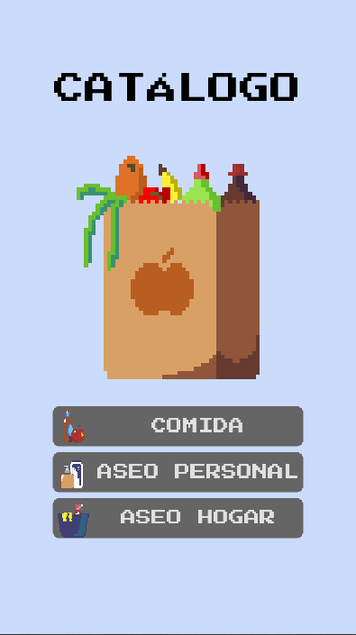
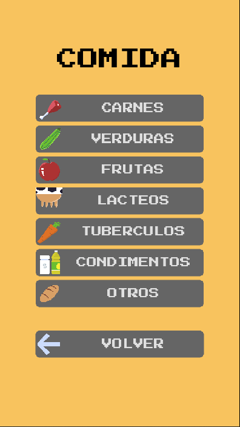
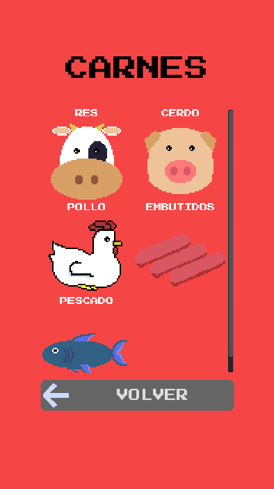
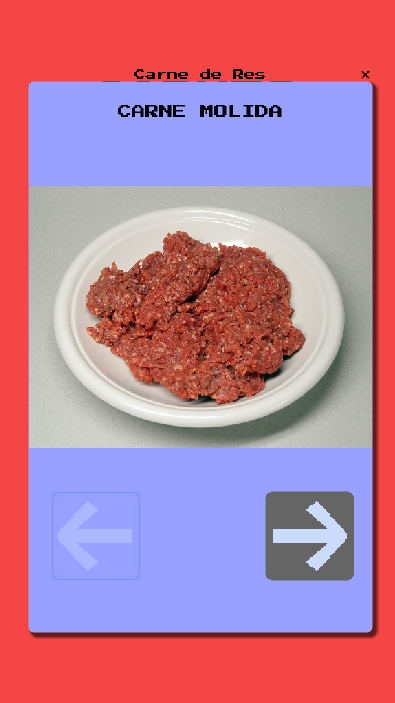

# catalogo_godot

_Por medio de esta aplicación se busca ayudar a una persona que tiene dificultades de comunicación (afasia) o a niños en proceso de aprendizaje a identificar objetos y productos comunmente usados o consumidos en el hogar._

## Plataforma 

_Este proyecto se desarrolla enfocado en la funcionalidad para dispositivos móviles Android._

## Construido con 🛠

* [Godot Engine](https://godotengine.org/download/windows) Motor de juego usado en su última versión a la fecha 3.2.3

## Exportación a Android 📱

_Para realizar la correcta exportación de la aplicación se siguen los pasos de la [documentación de Godot Engine](https://docs.godotengine.org/es/stable/getting_started/workflow/export/exporting_for_android.html)_

## Sobre derechos

_Este es un proyecto personal y no tiene ningún fin comercial._

## Captura de pantalla de la aplicación

